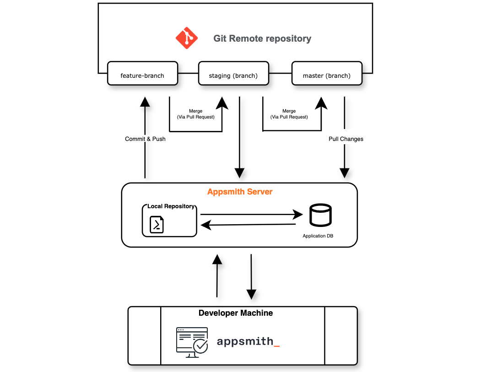

# Git ja GitHub: Ohjelmistokehityksen kulmakivet

Git on versiohallintajärjestelmä, joka tarjoaa luotettavan ja tehokkaan tavan hallita projekteja ja seurata niiden kehittymistä. Sen avulla voit hallita koodimuutoksia, työskennellä samanaikaisesti useiden versioiden kanssa ja palata projektin aikaisempiin tiloihin tarvittaessa. Git toimii ensisijaisesti paikallisena työkaluna, mutta sen avulla voit synkronoida työsi etäpalvelimille ja tehdä yhteistyötä globaalisti.

GitHub puolestaan on Git-repositorion isännöintialusta, joka yhdistää Gitiin tehokkaat verkkotyökalut ja tekee yhteistyöstä intuitiivista. GitHub tarjoaa käyttäjille mahdollisuuden jakaa projektejaan, hallita tehtäviä ja käyttää monipuolisia ominaisuuksia, kuten koodikatselmuksia ja integraatiotyökaluja. Molemmat teknologiat ovat välttämättömiä työkaluja nykyaikaisessa ohjelmistokehityksessä.

## Git: versionhallinnan sydän

Gitin tärkeimpiin ominaisuuksiin kuuluvat:

- **Muutostenhallinta:** Git seuraa tarkasti kaikkia projektin muutoksia ja tarjoaa yksityiskohtaisen historian.
- **Paikallinen toiminta:** Voit tehdä työtä ilman internet-yhteyttä ja synkronoida työsi myöhemmin.
- **Helppo haarautuminen:** Git mahdollistaa uuden haaran luomisen projektin testaukseen tai uusien ominaisuuksien kehittämiseen.

Gitin perustoiminnot alkavat paikallisella asennuksella, jonka jälkeen voit alustaa repositorion komennolla `git init`. Muutoksia hallitaan yksinkertaisilla komennoilla, kuten `git add` ja `git commit`. Näiden avulla projektin kehitys etenee loogisesti ja organisoidusti.

## GitHub: yhteistyön ytimessä

GitHub ei pelkästään tue versionhallintaa, vaan laajentaa sen toimintoja tuomalla mukaan tehokkaita yhteistyötyökaluja. Alustan avulla:

- **Tiimityö tehostuu:** Voit työstää samaa projektia useiden käyttäjien kanssa.
- **Pull requestit:** Näiden avulla voit ehdottaa muutoksia ja tarkistaa ne ennen niiden yhdistämistä.
- **Automaatio:** GitHub Actions tarjoaa kehittyneitä työkaluja, kuten automaattisten testien suorittamisen ja CI/CD-pipelinejen hallinnan.

GitHub on erinomainen alusta sekä aloittelijoille että kokeneille kehittäjille, sillä sen graafinen käyttöliittymä ja kattava dokumentaatio tekevät käytön helpoksi.

## Käyttöopas: Git ja GitHub yhdessä

Kun Git on asennettu paikallisesti, GitHubin käyttö alkaa helposti:

1. Luo uusi repositorio GitHubissa verkkoselaimesi kautta.
2. Kloonaa repositorio paikallisesti komennolla `git clone`.
3. Työskentele projekteissasi tekemällä muutoksia ja tallenna ne paikallisesti.
4. Synkronoi muutoksesi GitHubiin komennolla `git push`.

Jos olet uusi käyttäjä, GitHubin [aloitusopas](https://docs.github.com/en/get-started) tarjoaa arvokasta tietoa alkuun pääsemiseksi.

## Konkreettinen esimerkki tiimityöstä

Kuvitellaan tilanne, jossa kehität uutta ohjelmisto-ominaisuutta kansainvälisessä tiimissä. Aloitat uuden haaran, jossa teet omat muutoksesi. Kun työ on valmis, luot pull requestin, jota muut tiimin jäsenet voivat tarkastella ja kommentoida. Lopulta muutokset yhdistetään päähaaraan, mikä luo järjestelmällisen ja läpinäkyvän työskentelyprosessin.

GitHubin avulla voit lisäksi hyödyntää automaattisia työkaluja, kuten GitHub Actionsia, joka suorittaa testit ja tarkistaa koodin laadun jokaisen muutoksen yhteydessä. Tämä vähentää manuaalista työtä ja parantaa lopputuloksen laatua.

## Lisäresurssit ja linkit

- [Gitin virallinen sivusto](https://git-scm.com/)
- [GitHubin dokumentaatio](https://docs.github.com)
- [Git-opas suomeksi](https://githowto.com/ru)
- [GitHub Classroom](https://classroom.github.com/) oppimiseen ja opettamiseen

Älä unohda lisätä tätä README-tiedostoa omaan repositorioosi! Hyvin kirjoitettu README auttaa muita ymmärtämään projektisi rakenteen, tavoitteet ja käyttöohjeet helposti.

